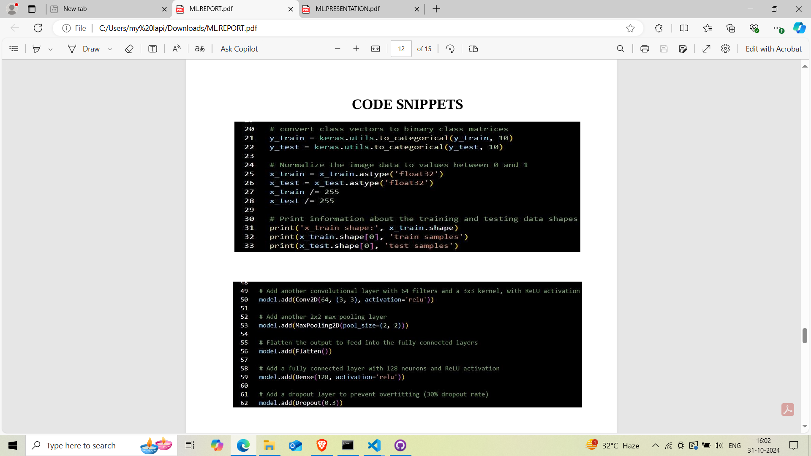

REFERENCES:
[MNIST ppt.pdf](https://github.com/user-attachments/files/17566336/MNIST.ppt.pdf)

[MNIST report.pdf](https://github.com/user-attachments/files/17566352/MNIST.report.pdf)- this file contains the report which highlights the important features of the project.
#MNIST HANDWRITTEN DIGIT RECOGNITION 
This project aims to develop an application that utilizes the MNIST dataset, a well-known benchmark for evaluating image processing systems, to recognize handwritten digits. We implement a Convolutional Neural Network (CNN), a specialized deep learning architecture that excels in image classification tasks, to achieve high accuracy in digit recognition. 
The application features a user-friendly graphical user interface (GUI) built with the Tkinter library, allowing users to draw digits directly on the screen. The drawn digit is then processed and classified by the trained CNN model in real-time, providing immediate feedback on the recognized digit. This project 
not only demonstrates the practical application of deep learning techniques but also enhances user interaction through its intuitive interface. The successful implementation of this application showcases the potential of machine learning in automating and improving handwriting recognition tasks, paving the way for further advancements in intelligent systems.

##MNIST DATASET
https://www.kaggle.com/datasets/hojjatk/mnist-dataset
The MNIST database (Modified National Institute of Standards and Technology database) is a large database of handwritten digits that is commonly used for training various image processing systems. The database is also widely used for training and testing in the field of machine learning. It was created by "re-mixing" the samples from NIST's original datasets. The MNIST database contains 60,000 training images and 10,000 testing images, which were were normalized to fit into a 28x28 pixel bounding box and anti-aliased, which introduced grayscale levels.

##LIBRARIES USED 
from keras.models import load_model
from tkinter import *
import tkinter as tk
import win32gui
from PIL import ImageGrab, ImageOps
import numpy as np

##REFERENCES
• https://keras.io/examples/vision/handwriting_recognition/ 
• https://www.geeksforgeeks.org/handwritten-digit-recognition-using
neural-network/ 
• https://www.researchgate.net/publication/356535395_Handwritten_Dig
 it_Recognition_System 
• https://data-flair.training/blogs/python-deep-learning-project
handwritten-digit-recognition/ 
• https://machinelearningmastery.com/handwritten-digit-recognition
using-convolutional-neural-networks-python-keras/ 
• https://towardsdatascience.com/handwritten-digit-mnist-pytorch
977b5338e627